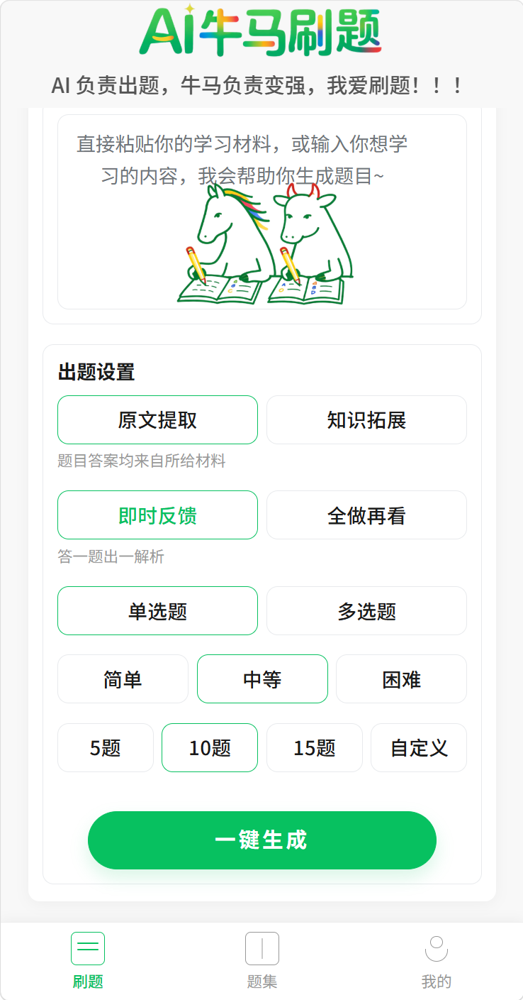
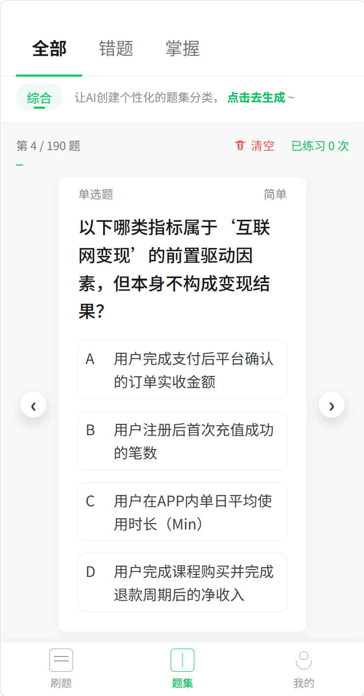
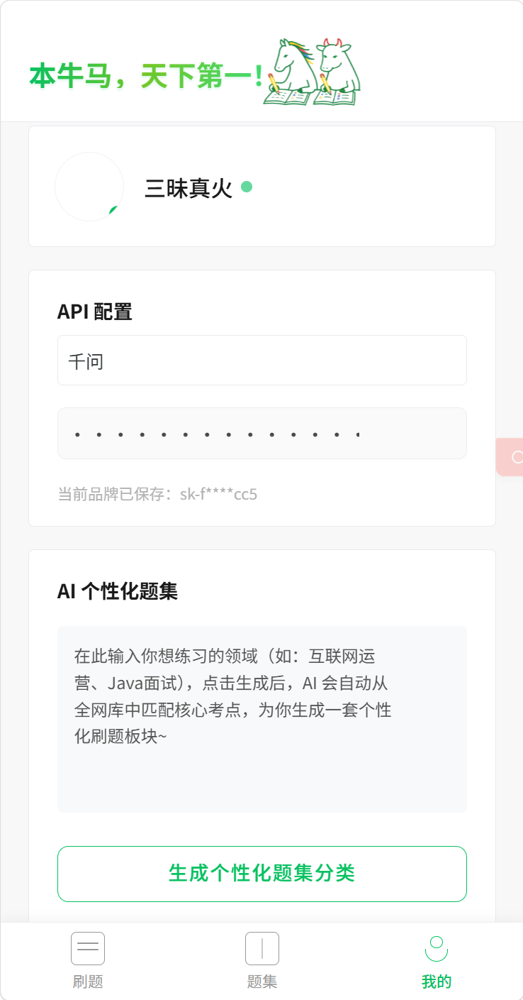

# AI牛马刷题

[简体中文](./README.md) | [English](./README.en.md)

> AI负责出题，牛马负责变强，我爱刷题！！！

AI牛马刷题是一个面向学习、面试和知识训练场景的 AI 刷题产品。它把用户手里的学习材料、知识点关键词和目标岗位方向，转成一套可以持续练习、持续复盘、持续沉淀的题集系统，而不是一次性的“生成几道题就结束”。

## 产品定位

它不是一个单纯的题目生成器，而是一条完整的学习闭环：

- 先把资料快速转成题目
- 再把做题结果沉淀成错题和掌握状态
- 再用标签和个性化题集，把后续练习越做越准

## 核心价值

- 把“看资料”变成“做练习”。用户不再只是被动阅读，而是把材料直接转成题目，立刻进入练习状态。
- 把“一次生成”变成“长期积累”。题目会沉淀到题集里，后续可以按错题、掌握、标签持续复盘。
- 把“通用刷题”变成“个性化训练”。用户可以输入想练的领域，让 AI 自动生成更贴近目标方向的题集分类。

## 产品亮点

- 双模式出题：`原文提取` 适合严格基于材料训练，`知识拓展` 适合围绕主题做延展练习。
- 双反馈机制：支持 `即时反馈` 和 `全做再看`，兼顾碎片化练习和完整测试。
- 题库持续沉淀：题目会进入题集，并按 `全部 / 错题 / 掌握` 组织，方便回看和重复训练。
- AI 个性化题集：用户在个人页输入目标方向后，系统可以自动生成标签并回溯归类历史题目。
- 多模型接入：前端支持配置 `Qwen / DeepSeek / OpenAI / Gemini` 等不同厂商的 API Key。
- 前后端分离：前端负责交互体验，后端负责认证、出题、校验和持久化，便于后续扩展。

## 产品预览

### 1. 智能出题首页



简介：用户直接粘贴学习材料，选择出题模式、反馈方式、题型、难度和题量，一键进入 AI 出题流程。

### 2. 题集沉淀与复盘



简介：题目会沉淀到题集里，并按 `全部 / 错题 / 掌握` 管理，结合进度、标签和清理能力，帮助用户做持续复盘。

### 3. 个性化配置与题集进化



简介：用户可以在个人页配置模型 API Key，并输入想练的领域，让 AI 生成个性化题集分类，逐步把题库训练成更贴合目标的练习系统。

## 适用场景

- 面试准备：把岗位知识点、面经、培训材料快速转成题目
- 考试复习：把课程笔记、章节知识点转成练习题
- 企业培训：把内部资料转成测验题和复盘题库
- 自主学习：围绕一个主题持续生成、持续纠错、持续巩固

## 技术实现

- 前端：Uni-app、Vue 3、TypeScript、Vite
- 后端：Node.js、CommonJS、MongoDB、OpenAI SDK
- 支持的模型提供方：Qwen、DeepSeek、OpenAI、Gemini
- 前端默认通过 `VITE_API_BASE_URL` 或本地存储决定后端地址，便于本地联调和部署切换

## 项目结构

```text
.
|- frontend/
|  |- src/
|  |- scripts/
|  |- tests/
|  `- package.json
|- backend/
|  |- src/
|  |- scripts/
|  |- package.json
|  `- package-lock.json
|- docs/
|  `- readme/
|- README.md
|- README.en.md
`- LICENSE
```

当前真正可运行的目录：

- 前端：`frontend`
- 后端：`backend`

## 快速开始

### 1. 启动后端

```powershell
cd backend
npm install
$env:STORAGE_DRIVER="file"
npm start
```

后端默认监听：`http://localhost:3000/api/v1`

说明：

- 本地开发时建议使用 `STORAGE_DRIVER="file"`，最省事
- 如果你有可用的 MongoDB，也可以切换到 `mongodb`
- 后端默认路由前缀是 `/api/v1`

### 2. 让前端连接本地后端

在 `frontend` 目录下新建 `.env.local`：

```env
VITE_API_BASE_URL=http://localhost:3000/api/v1
```

如果不配置，前端会回退到代码中的默认线上 API 地址。

### 3. 启动前端

```powershell
cd frontend
npm install
npm run dev:h5
```

如果你需要微信小程序版本：

```powershell
cd frontend
npm run dev:mp-weixin
```

### 4. 配置模型 Key

进入前端个人页后，可以直接配置当前模型提供方的 API Key。项目目前支持：

- `qwen`
- `deepseek`
- `openai`
- `gemini`

## 常用脚本

### 前端

- `npm run dev:h5`：启动 H5 开发环境
- `npm run dev:mp-weixin`：启动微信小程序开发环境
- `npm run build:h5`：构建 H5
- `npm run build:mp-weixin`：构建微信小程序
- `npm run type-check`：TypeScript 类型检查
- `npm run validate:generation`：校验生成链路 fixture
- `npm run validate:generation:payload`：校验生成结果 payload

### 后端

- `npm start`：启动服务
- `npm run smoke`：基础烟测
- `npm run auth:smoke`：认证相关烟测
- `npm run mongo:smoke`：MongoDB 相关烟测
- `npm run qwen:test`：Qwen 实时调用测试
- `npm run deepseek:test`：DeepSeek 实时调用测试
- `npm run llm:rules:test`：LLM 规则链路测试

## License

本项目使用 MIT License，见 [LICENSE](./LICENSE)。
